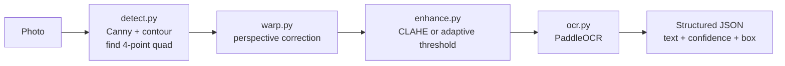

# Document Scanner & OCR

> Classical OpenCV document scanner (edge detection, perspective correction, CLAHE/adaptive contrast) feeding PaddleOCR for structured text extraction — no deep learning in the vision pipeline.

[](https://github.com/Prithv122/doc-scanner-ocr/actions/workflows/ci.yml)

**Live demo:** not deployed — a CLI, runs locally (see §6)
**Stack:** Python 3.12 · OpenCV · PaddleOCR (PP-OCRv6) · pytest · ruff · GitHub Actions

---

## 1. The problem

Turning a phone photo of a printed page into structured, searchable text needs two separable
problems solved correctly, in order: find the page and undo the camera's perspective *before*
asking an OCR model to read it, then choose an image enhancement that actually helps a modern
*learned* text recognizer rather than one tuned for classical engines. This project builds both
stages from first principles with OpenCV — no pretrained detector for the page itself — and
measures, rather than assumes, which contrast-enhancement choice helps PaddleOCR read the result.

## 2. The data

| | |
|---|---|
| Source | [SmartDoc 2015 – Challenge 1](https://zenodo.org/record/1230218) sample train kit (ICDAR 2015 competition), real smartphone-camera video of printed documents |
| Size | 9 frames (3 videos × 3 sampled timestamps), 1920×1080, ~1.3 MB total, committed in `data/smartdoc_sample/` |
| Licence | CC BY 4.0 — see `data/smartdoc_sample/ATTRIBUTION.md` for the full citation |
| Refresh | one-off, fixed subset |

This is a deliberately small, fixed sample of a ~24,000-frame public dataset — not the full
corpus, and not synthetic. Every number in §5 is measured against these 9 real photographed
frames, each with its own ground-truth document corners (from the dataset's own XML
annotations) and a small set of hand-verified, confidently-legible key phrases (see
`data/smartdoc_sample/ocr_ground_truth.json` and `NOTES.md` for why full-page transcription
wasn't attempted).

## 3. Architecture



## 4. Key decisions & tradeoffs

| Decision | Chose | Over | Why |
|---|---|---|---|
| Document-area threshold | `min_area_ratio=0.05` | An initial `0.2` (tuned only against synthetic close-up test images) | Measured against real photos: the document occupies only 9-15% of frame area at a natural phone-camera distance. The `0.2` default silently rejected all 9 real frames before this was caught — see NOTES.md. |
| Contrast enhancement before OCR | CLAHE | Adaptive Gaussian thresholding | Measured, not assumed (§5): CLAHE gives 50% key-phrase recall on real photos vs. adaptive threshold's 2%. Hard binarization clips the thin/anti-aliased strokes a *learned* recognizer (PaddleOCR) was trained on; CLAHE preserves grayscale gradient information instead. |
| Output size derived from corner geometry | `compute_output_size` measures each pair of opposite edges and takes the longer | A fixed aspect ratio (e.g. always output A4) | A document photographed at an angle projects its near and far edges to different pixel lengths; assuming a fixed ratio would stretch or crop real content. |
| OCR accuracy metric | Fuzzy (difflib) similarity against hand-verified key phrases | Exact substring match | A real run recognized a headline as "Tackding Tibet." at 97.6% confidence against a true "Tackling Tibet" — a one-character misread. Exact matching scored that as a complete miss despite the OCR having essentially read it; fuzzy matching (≥0.85 similarity) reports what actually happened. |
| Fallback on failed detection | Run OCR on the original, un-warped image | Fail/skip the frame | A photo that's already a flat, front-on shot of a page has no perspective to correct but still has real text worth extracting. |

## 5. Results

Measured by `scripts/benchmark.py` against the 9 real SmartDoc photos (§2); raw output in
`data/smartdoc_sample/results.json`.

| Metric | Value | Baseline | Notes |
|---|---|---|---|
| Document detection rate | 9/9 (100%) | — | After correcting `min_area_ratio` for real photo-taking distance (see §4) |
| Mean corner localization error | 5.1 px | — | On 1920×1080 frames — 0.27% of frame width. Measured against the dataset's own XML ground truth. |
| Mean corner quadrilateral IoU | 0.975 | — | Intersection-over-union of predicted vs. ground-truth document quad |
| OCR key-phrase recall, CLAHE | 50% | Adaptive threshold: 2.2% | Fuzzy match (≥0.85 similarity) against hand-verified key phrases; see §4 |
| OCR key-phrase recall, adaptive threshold | 2.2% | — | Confirms the CLAHE decision in §4 rather than assuming it |

Recall varies sharply with real-world image quality, not just which enhancement is used: the
sharpest datasheet frame hits 100% recall, while frames from the motion-blurred letter/magazine
clips range from 0% to 100% depending on how legible the specific frame is. This project makes no
claim about frames the SmartDoc corpus itself doesn't include (e.g. curled pages, extreme low
light) — see §7.

## 6. How to run

```bash
git clone https://github.com/Prithv122/doc-scanner-ocr.git
cd doc-scanner-ocr
uv sync
uv run pytest
```

No accounts, API keys, or GPU required. On first real OCR use, PaddleOCR downloads its
detection/recognition model weights over the network (one-time, cached in
`~/.paddlex/official_models`) — expect a delay the first time, not a hang.

Run the scanner on any image:

```bash
uv run doc-scanner-ocr path/to/photo.jpg
uv run doc-scanner-ocr path/to/photo.jpg --enhance adaptive -o result.json
```

Reproduce the §5 numbers:

```bash
uv run python scripts/benchmark.py
```

## 7. What I'd change at 100× scale

- **Detection would need to handle curved pages and occlusion**, not just flat quadrilaterals.
  `find_document_contour` assumes a clean 4-point boundary; a genuinely creased or curled page
  (common with books, receipts) needs a learned segmentation model (e.g. a U-Net-style page
  mask) rather than Canny + `approxPolyDP`, which this project deliberately avoids per the
  catalog's "CV without deep learning" scope.
- **OCR would run as a batched service, not one model load per process.** `get_engine()` lazily
  constructs one `PaddleOCR` instance per process; at real throughput this becomes a persistent
  worker pool with batched `predict()` calls rather than one image at a time.
- **The 5.1px corner error would need a tighter loop with downstream cost.** At 100× the
  volume, even sub-pixel corner error compounds into visibly warped output on some fraction of
  images; the fix is sub-pixel corner refinement (e.g. `cv2.cornerSubPix`) rather than accepting
  the current pixel-level `approxPolyDP` output as final.
- **The evaluation set is 9 frames.** That's enough to catch the `min_area_ratio` bug and measure
  a real CLAHE-vs-adaptive gap, but not enough to trust the 50% recall number as a population
  estimate — at scale this needs hundreds of labeled frames across lighting/blur/angle
  conditions, ideally the SmartDoc corpus's full ~24,000 frames.

---

## References

- J. Chazalon, P. Gomez-Krämer, J.-M. Ogier, M. Rusiñol, F. Damecasa, D. Lisu, N. Journet,
  "SmartDoc 2015 Challenge 1: Smartphone Document Capture," *ICDAR 2015 Competitions*, 2015 —
  source of the real photographed test images (see `data/smartdoc_sample/ATTRIBUTION.md`).
- [PaddleOCR](https://github.com/PaddlePaddle/PaddleOCR) (PP-OCRv6) — the OCR engine used
  as-is via the `paddleocr` package; no fine-tuning performed.
